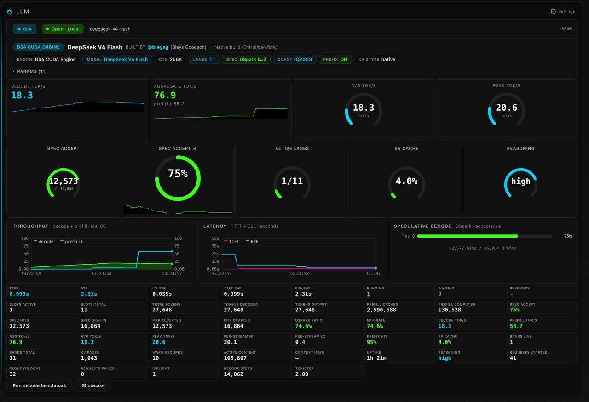

# sparkDash ⚡ — Multi-unit monitoring dashboard for NVIDIA DGX Spark

<p align="center">
  
  
  
  
  <br>
  <sub>by <a href="https://x.com/MiaAI_lab">Mia'a AI Lab</a></sub>
  <br><br>
  <a href="https://x.com/MiaAI_lab" target="_blank" style="display:inline-block;margin:0 8px;vertical-align:middle;"></a>
</p>

sparkDash is a real-time web dashboard for one or more **NVIDIA DGX Spark (GB10)** machines in a single browser window. It streams GPU, CPU, unified memory, storage, network, and local LLM metrics — and lets you add, edit, reorder, or remove Sparks from the UI without restarts or code changes.


### LLM Prompt Showcase

<a href="https://github.com/MiaAI-Lab/sparkDash/releases/download/media-showcase/llm-showcase.mp4">
  
</a>

<p align="center"><sub><a href="https://github.com/MiaAI-Lab/sparkDash/releases/download/media-showcase/llm-showcase.mp4">Download MP4</a> · also in <code>assets/llm-showcase.mp4</code></sub></p>

---

## Table of contents

- [Latest version changelog](#latest-version-changelog)
- [Features](#features)
- [ComfyUI monitoring](#comfyui-monitoring)
- [Full changelog](./CHANGELOG.md)
- [Quick start](#quick-start)
- [Architecture](#architecture)
- [Tech stack](#tech-stack)
- [Repository layout](#repository-layout)
- [REST API](#rest-api)
- [Configuration](#configuration)
- [Security](#security)
- [Scripts](#scripts)
- [How it works](#how-it-works)
- [Contributing](#contributing)
- [License](#license)

---

## Latest version changelog

### Version 1.7.0 — DS4 CUDA telemetry, synthwave theme, 42-card grid
- **DS4 CUDA Engine support** — full telemetry for Entrpi/ds4-on-spark v0.6.2: DSpark acceptance, banks/lanes, memory census, reasoning effort, active context, provenance ("Built by @bleysg")
- **Synthwave theme** — purple/magenta/green temperature scale color spectrum for LLM panel
- **Radial odometers** — Avg & Peak tok/s as car-speedometer gauges (max=100)
- **42-card advanced grid** — all available metrics in dense 8-column layout
- **Config & provenance at top** — engine type, model, author accreditation, config badges, collapsible params
- **Per-position spec decode** — always visible, synthesized for DS4 from overall ratio
- **Backend-adaptive panel** — cards populate from data availability, not hardcoded backend names
- **Graph yMax=100** — throughput scale capped at 100 tok/s

### Version 1.6.0 — ComfyUI monitoring & compact default
- **ComfyUI** — opt-in per Spark (port 8188): live jobs, progress, last run, cancel, queue ETA, Open on LAN IP, model inventory
- **Overview** — Comfy status chip (`idle` / `run` / `Nq`)
- **Layout** — collapsible Resources / Services; LLM + Comfy side-by-side; multi-LLM row rules
- **Compact UI** — default density (comfortable still in Settings)

Full history: [CHANGELOG.md](./CHANGELOG.md)

---

## Features

| Area | What you get |
|------|----------------|
| **Multi-unit** | Any number of Sparks; each has a tabbed detail page plus a shared Overview |
| **Live streaming** | WebSocket metrics with configurable poll intervals; central history store for sparklines across tab switches |
| **Local + remote** | Host metrics via sysfs/proc/`nvidia-smi`; remotes over SSH (key or password) |
| **LLM probe** | Auto-detects llama.cpp, vLLM, sglang, or ds4-server; 40+ live telemetry metrics, per-position spec decode, radial odometers, provenance/accreditation |
| **ComfyUI** | Opt-in probe: queue/jobs, progress, cancel, Open link, inventory, overview chip |
| **Decode benchmark** | Multi-concurrency streaming decode tok/s (server + per-stream), persisted last run |
| **Prompt Showcase** | Full-page multi-terminal LLM streaming demo (up to 32 prompts) with live tok/s and copy-out |
| **vLLM health** | KV cache %, run/wait queue, TTFT/E2E/ITL p95, preemptions, prefix cache, MTP accept from Prometheus `/metrics` |
| **Multiple LLM ports** | Monitor several LLM servers on different ports simultaneously — each gets its own panel with independent backend detection and metrics |
| **GPU processes** | See the top GPU processes by VRAM usage directly in the GPU panel, including process name and memory allocation |
| **Spark uptime** | System uptime displayed inline on each Spark header for at-a-glance availability |
| **Power controls** | Graceful shutdown (SSH host script) and Wake-on-LAN; batch actions on Overview |
| **Spark roles** | **Head** / **Worker** / **Standalone** — worker label + head link; standalone can disable LLM monitoring |
| **Unified memory** | GB10 128 GB LPDDR5X pool (~273 GB/s), GPU/CPU split, bandwidth via `nvidia-smi dmon` |
| **Themes** | Dark, light, cool white, OLED, **Synthwave** (purple/magenta/green temperature scale) — persisted in `localStorage` |
| **Secrets** | SSH passwords AES-256-GCM encrypted; never in `sparks.json` or API responses |
| **Docker-first** | Single privileged container for host metrics; prod and dev Compose files |
| **Hot config** | Add / edit / remove / reorder Sparks from the UI with no process restart |

---

## ComfyUI monitoring

sparkDash can **optionally** monitor a [ComfyUI](https://github.com/comfyanonymous/ComfyUI) instance on each Spark — the same way it probes local LLMs, but focused on **jobs and queue**, not a second copy of GPU/RAM bars (those stay on the GPU / CPU panels).

### What is supported

| Capability | Details |
|------------|---------|
| **Opt-in per Spark** | `comfyMonitoring` (default **off**) + `comfyPort` (default **8188**) |
| **Any role** | Head, worker, and standalone can enable ComfyUI independently of LLM cluster role |
| **Liveness** | `GET /system_stats` — online, ComfyUI / PyTorch version, device type (cpu/cuda) |
| **Queue / jobs** | `GET /queue` — running + pending items; workflow **title**, **model/LoRA** filenames from the graph, footprint (**resolution · steps · sampler · batch · node count**) |
| **Progress** | Progress bar on the active job — Comfy WebSocket when events are available; otherwise elapsed / average-duration **estimate** |
| **Last finished job** | Status + duration via `/api/jobs` (fallback `/history`) |
| **Queue ETA** | Estimate from recent job durations × pending (+ progress remainder when known) |
| **Cancel / remove** | From the Comfy card: interrupt a running job or dequeue a pending one (`POST /api/sparks/:id/comfy/cancel`) |
| **Open ComfyUI** | One-click link to `http://{lanIp}:{comfyPort}` (LAN IP preferred so remote browsers do not hit localhost) |
| **Model inventory** | Checkpoints + LoRAs from `/models/*` (UI section only when at least one file is listed) |
| **Overview chip** | When monitoring is on: `Comfy · idle` / `run` / `Nq` / muted if unreachable |
| **Layout** | Under **Services**: primary LLM + Comfy side-by-side when both are enabled; collapsible **Resources** / **Services** sections |

**Not claimed:** true per-job VRAM (Comfy does not expose that cleanly over HTTP). Host GPU/VRAM remains on the GPU panel. Live step progress depends on Comfy broadcasting WS events; stock Comfy often scopes detailed progress to the client that submitted the prompt.

### How to enable (per Spark)

1. Open the Spark tab → **Edit** (pencil).
2. Enable **ComfyUI monitoring**.
3. Set **port** if needed (default **8188**).
4. **Save**.

The Spark page **Services** section shows the ComfyUI card. On Overview, a small Comfy chip appears for that unit.

**Connectivity Test** (in Edit) includes ComfyUI when monitoring is enabled.

### ComfyUI side requirements

- ComfyUI must be reachable from the **sparkDash server** on the probe host:
  - **Local Spark** (`isLocal`): sparkDash probes `127.0.0.1:{port}` (use Docker `network_mode: host` if the dashboard runs in a container).
  - **Remote Spark**: probe uses the Spark **LAN IP** (same as LLM probes).
- For **Open** from another machine’s browser, Comfy should listen on a reachable interface (e.g. `--listen 0.0.0.0`), not only loopback, and the Spark’s **LAN IP** must be set correctly in Edit.

### Config fields (persisted on the Spark)

| Field | Default | Description |
|-------|---------|-------------|
| `comfyMonitoring` | `false` | Probe ComfyUI and show the card / overview chip |
| `comfyPort` | `8188` | ComfyUI HTTP port |

### Related API

| Method | Path | Purpose |
|--------|------|---------|
| POST | `/api/sparks/:id/comfy/cancel` | Cancel a job (`{ "promptId": "<uuid>" }`) — interrupt running and/or remove from queue |

Env (optional): `COMFY_PORT` (default `8188`), `COMFY_PROBE_TIMEOUT_MS`, `POLL_INTERVAL_COMFY`.

---

## Quick start

```bash
git clone https://github.com/MiaAI-Lab/sparkDash.git
cd sparkDash

# Production (Docker)
docker compose up --build -d

# Or development (host, with hot reload)
npm install
npm run dev
```

- **Docker**: open **http://&lt;host-ip&gt;:5555** (arm64 image, auto-restart, host mounts for GPU/metrics access)
- **Dev**: Vite on **http://localhost:5173** (proxies API/WS to Express)

For development with Docker (source-mounted, HMR):
```bash
docker compose -f docker-compose.dev.yml up --build
```

---

## Architecture

Design principle: **one Spark model, N instances**. Every Spark is a record in `config/sparks.json`. The same `SparkMonitor`, `SystemCollector`, and `LlmProbe` code runs for all of them. Adding a unit is a config change, not a code change.

```txt
┌────────────────────── Docker container (sparkDash) ──────────────────────┐
│  Express (server/)                                                         │
│  ├─ config/sparks.json        Spark registry (API read/write)              │
│  ├─ SparkRegistry             load/persist Sparks; change events           │
│  ├─ SparkMonitor (per Spark)  collector + LLM probe + rate baselines       │
│  │   ├─ SystemCollector       local sysfs/proc OR remote SSH               │
│  │   └─ LlmProbe              HTTP to host:LLM_PORT, backend autodetect    │
│  ├─ REST /api/*                                                            │
│  └─ WebSocket /ws             snapshot stream to browsers                  │
│  React SPA (src/)  — Overview + per-Spark pages, themes, dialogs           │
└────────────────────────────────────────────────────────────────────────────┘
         │ SSH (key or sshpass)                    │ HTTP :8888
         ▼                                         ▼
    remote Spark(s)                         each Spark’s LLM server
```

### Data flow

```txt
Browser  ←→  WebSocket /ws   ←→  SparkMonitor.snapshot()  ←→  collectors
Browser  ←→  REST /api/*     ←→  SparkRegistry + SparkMonitor
```

Poll loops run in the background (even with no clients) so rate metrics — tokens/s, network bytes/s, disk I/O — stay correct.

---

## Tech stack

| Layer | Stack |
|-------|--------|
| Frontend | React 19, TypeScript, Vite 8, Tailwind CSS v4 |
| Backend | Node.js (ESM), Express 5, `ws` |
| Platform | ARM64 — DGX Spark GB10 (Neoverse V2) |
| Deploy | Docker multi-stage (arm64), Compose |
| Secrets | AES-256-GCM SSH password store |
| Ports | **5555** dashboard/API; **5173** Vite (dev only) |

---

## Repository layout

```txt
sparkDash/
├── src/                 React + TypeScript SPA
│   ├── api/             REST client + shared types
│   ├── components/      Overview, Spark pages, dialogs, UI primitives
│   ├── hooks/           WebSocket snapshot, routing
│   └── theme / CSS      Tailwind v4 + four themes
├── server/              Express + WebSocket (plain JS ESM)
│   ├── sparks/          SparkRegistry, SparkMonitor
│   ├── collectors/      SystemCollector, LlmProbe, ssh
│   ├── secretsStore.js  Encrypted password persistence
│   └── validate.js      Host/user validation (SSRF-minded)
├── config/              Runtime state (volume; secrets gitignored)
├── assets/              Screenshots
├── Dockerfile           Production multi-stage arm64
├── docker-compose.yml   Production
├── docker-compose.dev.yml
└── deploy.sh            Rebuild / recreate helpers
```

---

## REST API

| Method | Path | Purpose |
|--------|------|---------|
| GET | `/api/sparks` | List Sparks (passwords redacted) |
| POST | `/api/sparks` | Add Spark and start its monitor |
| PATCH | `/api/sparks/:id` | Update Spark (hot-swap config) |
| DELETE | `/api/sparks/:id` | Remove Spark and drain monitor |
| PUT | `/api/sparks/order` | Persist tab order |
| GET | `/api/sparks/:id/metrics` | One-shot metrics snapshot |
| POST | `/api/sparks/test` | Ephemeral SSH + LLM (+ Comfy if enabled) test (no persist) |
| POST | `/api/sparks/:id/test` | Connectivity test (can save password) |
| POST | `/api/sparks/:id/comfy/cancel` | Cancel ComfyUI job by `promptId` |
| PUT | `/api/sparks/:id/password` | Save SSH password (works offline) |
| PUT | `/api/sparks/:id/disabled-devices` | Hide storage devices (hot) |
| PUT | `/api/sparks/:id/disabled-interfaces` | Hide network interfaces (hot) |
| PUT | `/api/sparks/:id/llm-ports` | Replace all LLM ports (hot) |
| POST | `/api/sparks/:id/llm-ports` | Add an LLM port (hot) |
| DELETE | `/api/sparks/:id/llm-ports/:port` | Remove an LLM port (hot) |
| PUT | `/api/sparks/:id/llm-port` | LLM port — backward-compat (hot) |
| GET | `/api/settings` | Global settings |
| PUT | `/api/settings` | Update global settings |
| WS | `/ws` | Real-time metrics stream |

There is no authentication on the HTTP/WebSocket API. Run sparkDash only on a trusted network (or behind your own reverse proxy with auth).

---

## Configuration

### Global settings (UI or API)

Gear icon in the header, or `GET`/`PUT` `/api/settings`:

| Setting | Default | Description |
|---------|---------|-------------|
| Poll interval | 2000 ms | WebSocket broadcast interval (minimum 1000 ms) |
| Default LLM port | 8888 | Default for new Sparks |
| Auto-hide offline | false | Hide offline Sparks on Overview |
| Temperature unit | Celsius | Display GPU temperature in °C or °F |

### Environment variables

Copy `.env.example` to `.env` if needed:

| Variable | Default | Description |
|----------|---------|-------------|
| `BIND_HOST` | `0.0.0.0` | HTTP and WebSocket listen address |
| `PORT` | `5555` | HTTP + WebSocket listen port |
| `LLM_PORT` | `8888` | Default LLM probe port |
| `COMFY_PORT` | `8188` | Default ComfyUI probe port |
| `POLL_INTERVAL_GPU` | `2000` | GPU poll (ms) |
| `POLL_INTERVAL_COMFY` | `2000` | ComfyUI probe poll (ms) |
| `POLL_INTERVAL_CPU` | `2000` | CPU / RAM poll (ms) |
| `POLL_INTERVAL_NETWORK` | `2000` | Network poll (ms) |
| `POLL_INTERVAL_STORAGE` | `5000` | Storage poll (ms) |
| `POLL_INTERVAL_LLM` | `2000` | LLM probe poll (ms) |
| `POLL_INTERVAL_BANDWIDTH` | `2000` | Memory bandwidth / dmon poll (ms) |
| `POLL_INTERVAL_LIVENESS` | `5000` | Online/SSH liveness check (ms) |
| `SPARKDASH_SECRETS_KEY` | _(auto)_ | Passphrase or 64-char hex for secret encryption |
| `HOST_PROC_PATH` | `/host/proc` | Host proc mount inside container |
| `HOST_SYS_PATH` | `/host/sys` | Host sys mount |
| `HOST_ROOT_PATH` | `/host/root` | Host root mount |

> When using Docker's default bridge network, keep `BIND_HOST=0.0.0.0`.  
> With `network_mode: host`, use `BIND_HOST=127.0.0.1` to restrict access to the local host or a reverse proxy.

### Adding a Spark

1. Open the **+** tab.
2. Set **Name**, **LAN IP** (required), optional **CX7 IP**, **SSH user**, and auth (key or password). Wake-on-LAN MAC is auto-read from **enP7s7** when online (optional override in Edit).
3. **Test Connection** for SSH + LLM reachability.
4. Save — a tab appears and metrics start streaming.

### Power controls (shutdown / Wake-on-LAN)

- **Shutdown** (per Spark or **Shutdown All** on Overview) runs over SSH:  
  `sudo -n /usr/local/bin/spark-shutdown`  
  Install that script on each Spark and allow passwordless sudo for it only.
- **Wake** / **Wake All** send a UDP magic packet (port 9). The MAC is taken from the **enP7s7** interface automatically while the Spark is online (persisted as `detectedMacAddress`). Optionally set a **MAC override** in Edit Spark. Broadcast is derived as `/24` from LAN IP, or `255.255.255.255` if LAN IP is missing.
- Batch shutdown only targets **online** Sparks; offline nodes are skipped.
- Same trust model as the rest of the API: **do not expose port 5555** beyond a trusted network — power actions are not separately authenticated.

### Themes

Header theme control cycles:

| Theme | Notes |
|-------|--------|
| **Dark** (default) | Neutral grays, true black base, muted amber accent |
| **Light** | Warm paper whites |
| **White** | Cool neutral whites |
| **OLED** | True black for OLED panels |
| **Synthwave** | Purple/magenta/green temperature scale — no red/orange/yellow. Brightness conveys intensity. Neon green = fast, hot pink = medium, purple = slow. Cyan = latency/cool metrics. |

> **Synthwave theme** — a custom color spectrum designed for at-a-glance LLM telemetry. Instead of red/green/yellow, it uses a temperature scale: purple/blue (cold/slow) → magenta/pink (warm/medium) → neon green (hot/fast). Cyan represents latency and cool metrics. The entire LLM panel — stat cards, gauges, charts, sparklines — follows this spectrum so you can read performance by color alone.

Choice is stored in `localStorage`.

---

## Security

- **SSH passwords** are not stored in `sparks.json` and are never returned by the API.
- Passwords are encrypted with **AES-256-GCM** in `config/sparks-secrets.json` (survives restarts).
- Encryption key: `config/.secrets-key` (auto-generated) or `SPARKDASH_SECRETS_KEY`. **Do not delete the key file** or encrypted secrets become unreadable.
- **Target validation** rejects clearly unsafe IPv4 targets (link-local `169.254.0.0/16`, `0.0.0.0/8`, multicast/reserved ≥ 224). Private, loopback, and public addresses are allowed so LAN and remote Sparks work.
- SSH and HTTP probes use short timeouts (about 5 s SSH connect, 3 s HTTP) so a hung host cannot stall the poll loop.
- Prefer **SSH keys** over passwords.
- Treat the dashboard as **LAN-trusted**: the API is intentionally unauthenticated for ease of use on a private network. That includes **power APIs** (shutdown / Wake-on-LAN): anyone who can reach the dashboard can request fleet power actions.


---

## Scripts

| Command | Purpose |
|---------|---------|
| `npm run dev` | Vite (5173) + Express (5555) together |
| `npm run dev:server` | Express only (`node --watch`) |
| `npm run dev:client` | Vite only |
| `npm run build` | Production frontend → `dist/` |
| `npm run typecheck` | `tsc --noEmit` |
| `npm start` | Production server (`node server/index.js`) |
| `npm run docker:up` | `docker compose up -d` |
| `npm run docker:prod` | Same as `docker:up` |
| `npm run docker:rebuild` | `docker compose up --build -d` |
| `npm run docker:dev` | Dev Compose |
| `npm run docker:dev:build` | Dev Compose with rebuild |
| `./deploy.sh` | Recreate container; `--build`, `--frontend` flags |

---

## How it works

### Local vs remote Sparks

One `SystemCollector` path for both modes. When `spark.isLocal` is true, metrics come from host sysfs/proc and `nvidia-smi` (often via nsenter into the host namespace). Remote Sparks wrap the same commands in a shared `sshExec()` helper (key agent or `sshpass`).

### Graceful degradation

Collectors catch errors and return zero/default metrics instead of crashing the loop. After sustained liveness failures, a Spark is marked offline; the UI shows stale or empty states rather than hard errors.

### Hot configuration

Name, IP, SSH credentials, LLM port, and device/interface filters update the running `SparkMonitor` without tearing down poll loops or losing rate baselines. Registry writes are atomic (temp file + rename).

### LLM probe

Each configured LLM port gets its own `LlmProbe` instance running in parallel. Probes auto-detect backends:

- **llama.cpp** — `/slots` for live decode rates; model from `/props`
- **DS4 CUDA Engine** (Entrpi/ds4-on-spark, v0.6.2) — `/v1/models` (`owned_by: ds4.c`) + Prometheus `ds4_*` counters; DSpark spec decode, memory census, bank/lane tracking, log-tailing for reasoning effort + active context
- **vLLM** — `/v1/models` + Prometheus `/metrics` counters (scientific notation supported); TTFT/E2E/ITL p95 from histograms, per-position spec decode acceptance, KV cache, prefix cache, preemptions
- **SGLang** — `/v1/models` + `/get_server_info` (`last_gen_throughput` when metrics off) or Prometheus `/metrics`; DFlash acceptance, prefill cached/computed, active context, peak aggregate

Rates are derived from per-probe cumulative counter diffs (or SGLang sticky throughput while it moves). Multiple ports can be added or removed at runtime without restarting the monitor.

### LLM Telemetry Panel

The LLM panel provides a dense, Grafana-style telemetry view with 40+ live metrics. A redesigned layout (top to bottom):



1. **Header bar** — backend badge (vLLM / SGLang / DS4), model name, port, thinking indicator
2. **Config & Provenance** — engine type, model name, author accreditation ("Built by @bleysg"), container/build image, config badges (context, lanes, spec decode method, quantization, prefix caching), collapsible params section
3. **Hero stats** — Decode tok/s (sparkline card), Aggregate tok/s (sparkline card), Avg tok/s (radial odometer, max=100), Peak tok/s (radial odometer, max=100)
4. **Gauge arcs** — Spec Accept %, Active Lanes (live/total), KV Cache %, Reasoning effort
5. **Chart row** — Throughput (decode + prefill, yMax=100), Latency (TTFT + E2E), Speculative Decode (per-position acceptance bars — Pos 0, Pos 1, Pos 2)
6. **Advanced stats** — 42 compact cards in an 8-column grid: TTFT, E2E, ITL p95, TTFT p95, E2E p95, Running, Waiting, Prefix Hit, Preempts, Uptime, Total Tokens, Spec Accept, GPU Mem, KV Cache, Active Context, Decode Steps, Tok/Step, Spec Drafts, Spec Hits, Spec Quench, Warm Records, KV Pages, Derived Artifacts, Prefill Cached, Prefill Computed, Admits Cold/Warm/Fork, Requests Started/Completed/Failed/Inflight, and more
7. **Actions** — Run decode benchmark, Open showcase

#### Three supported backends

The probe auto-detects which inference engine is running and adapts the telemetry accordingly. All three backends share the same panel — cards populate from whatever data is available.

| Backend | Detection | Metrics source | Key metrics |
|---------|-----------|----------------|-------------|
| **vLLM** | `/v1/models` → `owned_by` not ds4/sglang; falls back to Prometheus `/metrics` counters | Prometheus `/metrics` (vLLM native counters + histograms) | Generation tok/s, prefill tok/s, KV cache %, TTFT/E2E/ITL p95 (from histograms), prefix cache hit rate, preemptions, MTP acceptance, per-position spec decode acceptance (`spec_decode_num_accepted_tokens_per_pos_total`), GPU memory utilization, recipe info from `/proc` cmdline + chat template |
| **SGLang** | `/v1/models` → `/get_server_info` (`last_gen_throughput`); or Prometheus `/metrics` | SGLang `/metrics` or `/get_server_info` | Generation tok/s, prefill tok/s, DFlash acceptance, total tokens, tok/step, decode steps, prefill cached/computed, requests, active context, peak aggregate, TTFT/E2E/ITL p95 (from SGLang histograms) |
| **DS4 CUDA Engine** | `/v1/models` → `owned_by: "ds4.c"`; fallback: `/metrics` regex `ds4_tokens_decoded_total` | DS4 Prometheus `/metrics` (`ds4_*` prefix) + `/v1/models` for model info | Generation tok/s, prefill tok/s, DSpark acceptance ratio, spec drafts/hits/quench, banks live/total (lanes), KV cache usage (from memory census `ds4_memory_bytes`), GPU memory utilization (from memory census), prefix cache hit rate (prefillCached / total), TTFT (estimated from prefill rate), ITL p95 (1/perStreamAvg), E2E latency, reasoning effort (from log tailing), active context (from log tailing), uptime, admits (cold/warm/fork/partial), warm records, KV pages resident, derived artifacts, tok/step, per-position spec decode (synthesized from overall ratio via geometric decay) |

**Backend-adaptive design:** The panel renders cards based on data availability, not hardcoded backend names. If a metric is null for one backend but available for another, the card shows "—" (em dash) — no panels are deleted or gated per-backend. This means switching from vLLM to DS4 to SGLang doesn't break the panel; it just populates different cards.

**DS4-specific derivations:** Since the DS4 CUDA engine doesn't expose vLLM-style histograms or per-position spec decode breakdowns, several metrics are derived:
- **TTFT** — estimated from prompt tokens / prefill rate (with rolling window fallback)
- **ITL p95** — approximated as 1 / perStreamAvg (inter-token latency)
- **kvCacheUsage** — from `ds4_memory_bytes{class="kv_primary"}` / 121GB
- **gpuMemoryUtilization** — from total `ds4_memory_bytes{domain="unified_device"}` / 121GB
- **prefixCacheHitRate** — `prefillCached / (prefillCached + prefillComputed)`
- **perPositionAcceptance** — synthesized from overall DSpark accept ratio using geometric decay (Pos 0 = 100%, Pos N = ratio^N)
- **reasoningEffort + activeContext** — from DS4 log file tailing (`/tmp/ds4-serve.log`)

---

## Contributing

Contributions are welcome. Conventions:

- **Server**: plain JavaScript ESM
- **Client**: TypeScript + React
- Prefer extending the shared Spark model over per-unit special cases

---

## License

[MIT](./LICENSE) — Copyright (c) 2026 Mia'a AI Lab

---

## Acknowledgements

- Built for the **NVIDIA DGX Spark (GB10)** on ARM64
- Rebuilt from a legacy multi-unit dashboard with a single shared Spark model (no copy-pasted “Spark N” code paths)
- LLM probe behavior refined from production monitoring experience
